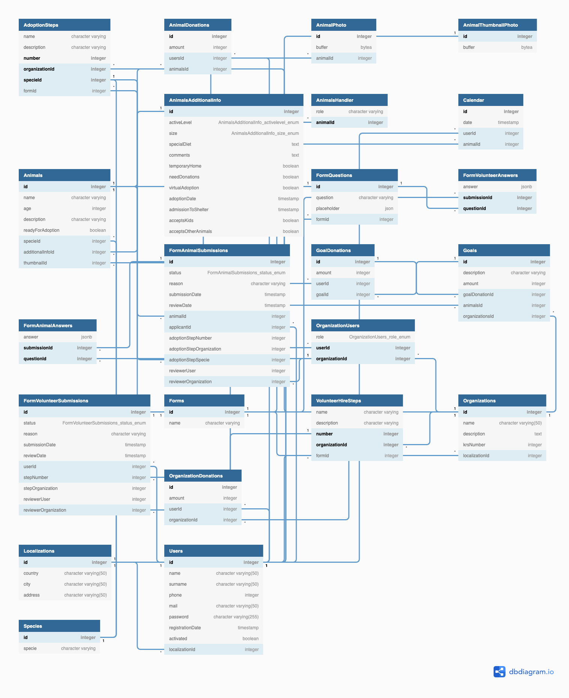

# CodersCamp 2020 | Projekt zespołowy | FullStack — Node.js + React | Strona schroniska dla zwierząt

## Zespół projektowy

Zespół pracował w ramach kursu [CodersCamp](https://coderscamp.pl/).
Aplikację wykonali uczestnicy kursu przy pomocy mentora.
Zachęcamy do odwiedzenia profili członków zespołu, w celu zapoznania się z ich portfolio.

**Mentor**: [Hubert Kawałek](https://github.com/htk4)

**Uczestnicy**:

-   [Anna Marszałek](https://github.com/Ania-Em)
-   [Mateusz Baciak](https://github.com/bat098)
-   [Mateusz Król](https://github.com/KrolMateusz)
-   [Mateusz Kmieć](https://github.com/Haivex)
-   [Tomasz Dudek](https://github.com/dudeek)
-   [Weronika Dziedzic](https://github.com/blackrabbit2)

## Demo

Wersja demonstracyjna aplikacji jest dostępna [TUTAJ](https://coders-camp-schronisko.herokuapp.com/api).

Front-end aplikacji znajduje się tutaj: [TUTAJ](https://github.com/CodersCamp2020-HK/CodersCamp2020.Project.FullStack-Node-React/tree/master/src/presentation/web).

Aplikacja została wykonana wg dostarczonych przez organizatorów CodersCamp wymagań.
Szablon projektu dostępny jest [TUTAJ](https://github.com/CodersCamp2020/CodersCamp2020.Project.FullStack-Node-React.Cinema).

## Cel projektu

Celem projektu było napisanie w pełni funkcjonalnego REST API wykorzystując dotychczas nabytą wiedzę z następujących technologi: html, css, javascript, typescript, nodejs, reactjs.

Zespół projektowy zdecydował się na stworzenie aplikacji schroniska dla zwierząt o nazwie Złapki. Aplikacja ma na celu usprawnienie działania schroniska dla zwierząt zarówno od strony osoby chcącej zaadoptować zwierzę jak i od strony pracowników schroniska, któzy zajmują się obsługą wniosków adopcyjnych i stanem zwierząt w schronisku. 

#### Główne funkcjonalności

- Wyszukiwanie i filtrowanie zwierząt gotowych do adopcji (Każdy użytkownik)
- Wysyłanie formularzy adopcyjnych (Osoba zalogowana do schroniska)
- Wbsługa bazy zwierząt (Pracownik schroniska)
- Rozpatrywanie wniosków adopcyjnych (Pracownik schroniska)

## Projekt graficzny 

Utowrzony został szablon graficzny aplikacji w programie Figma. 

[Link do Figmy](https://www.figma.com/file/DKIdy7VNeGNmGy5RNB8v9P/Schronisko?node-id=6363%3A15378)

## Wymagania funkcjonalne (szczegółowo):

### Rejestracja/Logowanie: 

1. Użytkownik ma możliwość zarejestrować się w systemie, podając imię, nazwisko, hasło, powtórzone hasło, telefon, datę urodzenia i adres e-mail.
2. Użytkownik ma możliwość zalogować się w systemie, podając adres e-mail i hasło.
3. Użytkownik otrzymuje wiadomość mailową z informacją o założeniu konta i linkiem aktywacyjnym.
4. Użytkownik ma możliwość zresetować swoje hasło do konta i ustawienia nowego, używając linka wysłanego na jego adres e-mail.
5. Użytkownik ma możliwość zmiany swoich danych. 
6. Użytkownik ma możliwość wylogowania się. 
7. Użytkownik ma możliwość usunięcia konta.

### Wyszukiwanie zwierząt: 
1. Użytkownik może przeglądać wszystkie zwierzęta znajdujące się w schronisku i czekające na adopcje. 
2. Użytkownik może ustawić filtry wyszukiwania, które pozwolą mu wybrać zwierzęcie takie jakie poszukje i pasujące do jego stylu życia.
3. Użytkownik może zapoznać się ze wszystkimi informacjami na temat wybranego zwierzęcia- szczegółowa karta zwierzecia z przeglądaniem galerii zdjęć. 

### O schronisku:
1. Na stronie internetowej można znaleźć informację na temat dokłądnego procesu adopcynego zwierzęcia. 
2. Na stronie internetowej można przeczytać informacje na temat schroniska Złapki i zespołu je tworzącego. 
3. Na stronie internetowej można znaleźć informacje kontaktowe do schroniska, wraz z mapą oznaczającą dokładne położenie schroniska.

### Wniosek adopcyjny:
1. Użytkownik po zalogowaniu sie na konto może złożyć wniosek adopcyjny na jedno wybrane zwierzę. 
2. Użytkownik może cały czas obserwować na jakim etapie procesu adopcyjnego znajduje się jego wniosek (Stepper)
3. Użytkownik może wypełnić formularz adopcyjny, różny dla pasa i kota. 
4. Użytkownik ma wgląd w wysłany formularz adopcyjny. 
5. Użytkownik po zaakceptowaniu wniosku przez pracownika schroniska może wybrać datę i godzinę obowiązkowego spotkania w schronisku (musi wybrać datę w przeciągu 2 tygodni od zaakceptowania jego wniosku przez pracownika).
6. Użytkonwik przy każdej zmianie statusu wniosku zostaje powiadomiony mailowo. 
7. Użytkownik zostaje powiadomiony mailowo, jeżeli jego wniosek nie został rozpatrzony pozytywnie lub gdy zwierzę zostało zaadoptowane przez inną osobę.

### Wniosek o zostanie wolontariuszem:
1. Użytkownik po zalogowaniu sie na konto może złożyć wniosek o zostanie wolontariuszem. 
2. Użytkownik może cały czas obserwować na jakim etapie znajduje się jego wniosek (Stepper)
3. Użytkownik może wypełnić formularz o zostanie wolontariuszem. 
4. Użytkownik ma wgląd w wysłany formularz o zostanie wolontariuszem. 

### Zarządzanie bazą zwierząt:
1. Pracownik schroniska ma możliwość dodawania zwierząt do bazy zwierząt (razem z załączeniem zdjęć zwierząt).
2. Pracownik schroniska ma możliwosć uaktualniania informacji o zwierzęciu.
3. Pracownik schroniska ma możliwość usuwania zwierzęcia z bazy zwierząt. 
4. Pracownik schroniska ma możliwość filtrowania zwierząt w bazie.

### Zarządzanie wnioskami o adopcje:
1. Pracownik schroniska ma wgląd we wszystkie wnioski adopcyjne.
2. Pracownik schroniska może filtrować wnioski adopcyjne.
3. Pracownik schroniska może przeglądać wnioski adopcyjne przypisane do zwierzęcia. 
4. Pracownik schroniska ma wgląd w wypełniony formularz adopcyjny, informacje o użytkowniku składającym formularz i o zwierzęciu, na który został złożony wniosek.
5. Pracownik schroniska może zaakaceptować albo odrzucić wniosek. 
6. Pracownik schroniska może potwierdzić zaadoptowanie zwierzęcia. 

### Zarządzanie wnioskami o adopcje:
1. Pracownik schroniska ma wgląd we wszystkie wnioski o zostanie wolontariuszem.
2. Pracownik schroniska może filtrować o zostanie wolontariuszem.
4. Pracownik schroniska ma wgląd w wypełniony formularz wolontariusza i w informacje o użytkowniku składającym formularz.
5. Pracownik schroniska może zaakaceptować albo odrzucić wniosek. 

## Wykorzystywane technologie

W trakcie developmentu wykorzystujemy:

-   NodeJS
-   Swagger
-   Tsoa
-   Docker
-   Heroku
-   TypeORM
-   PostgreSQL
-   GitHub workflow
-   React JS
-   React Router
-   Restful React
-   React Hook Form
-   Material UI
## Development aplikacji

### Przykładowa funkcjonalność bazy danych aplikacji

### Schemat bazy danych

### Uruchomienie projektu

Aby uruchomić aplikację na lokalnej maszynie, wykonaj następujące kroki:

1. Zainstaluj zależności za pomocą komendy: `npm ci`
2. Uruchom kontenery z bazą danych oraz narzędziem pgAdmin: `docker-compose up`
3. Wystartuj serwer developerski `npm run dev`

Aplikacja będzie dostępna pod adresem [localhost:3080/](http://localhost:3080), natomiast API pod adresem [localhost:8000/](http://localhost:8000/api)

Kod produkcyjny aplikacji umieszczamy w katalogu `build`.

### Uruchomienie testów

Aby uruchomić testy aplikacji, wykonaj następujące kroki:

1. Zainstaluj zależności za pomocą komendy: `npm ci` (jeśli nie zrobiłeś już tego wcześniej).
2. Uruchom wszystkie testy, wykonując komendę: `npm run test`.

Dostępne są także testy tylko dla serwera `npm run server:test`, dla testów z pokryciem kodu `npm run server:test:cov`.
Testy tylko dla aplikacji webowej `npm run web:test`, dla testów z pokryciem kodu `npm run web:test:cov`.
Kod testów umieszczamy w katalogu `test`.

### Organizacja pracy

Praca zespołu była organizowana przy użyciu narzędzi dostarczanych przez GitHub.
Zadania opisywaliśmy za pomocą GitHub Issues i dzieliśmy czas ich wykonania na tygodnie za pomocą GitHub Projects.
Każde z zadań było estymowane przez mentora, dzięki czemu staraliśmy się, aby liczba punktów przypadająca w danym tygodniu na każdą osobę w zespole była podobna.
